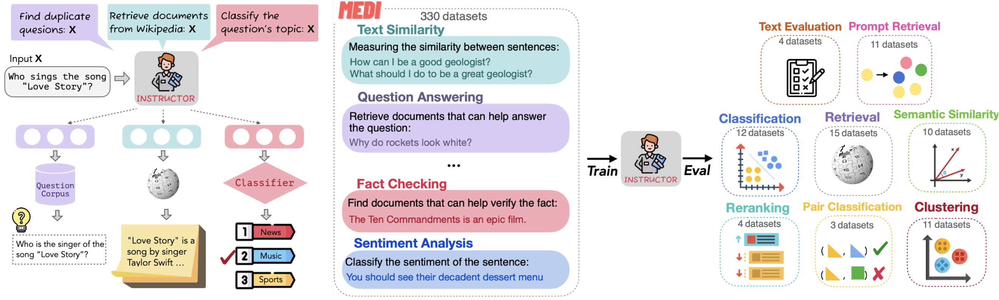

# CS221 - Đồ án: INSTRUCTOR Embedding

<p align="center">
  
</p>

## 📚 Giới thiệu

Đồ án này nghiên cứu và triển khai paper **"One Embedder, Any Task: Instruction-Finetuned Text Embeddings"** (INSTRUCTOR) - một mô hình text embedding có thể tạo ra embeddings tùy biến cho bất kỳ task nào chỉ bằng cách cung cấp instruction phù hợp.

### 📄 Thông tin Paper

| | |
|---|---|
| **Tên paper** | One Embedder, Any Task: Instruction-Finetuned Text Embeddings |
| **Tác giả** | Hongjin Su, Weijia Shi, Jungo Kasai, Yizhong Wang, Yushi Hu, Mari Ostendorf, Wen-tau Yih, Noah A. Smith, Luke Zettlemoyer, Tao Yu |
| **Tổ chức** | University of Washington, University of Hong Kong, Meta AI, Allen Institute for AI |
| **Năm** | 2022 |
| **Link** | [arXiv](https://arxiv.org/abs/2212.09741) / [ACL 2023 Findings](https://aclanthology.org/2023.findings-acl.71) |

---

## 🎯 Ý tưởng chính

**INSTRUCTOR** giải quyết vấn đề: *"Làm sao để một mô hình embedding duy nhất có thể hoạt động tốt trên nhiều tasks khác nhau?"*

### Giải pháp: Instruction-Finetuned Embeddings

Thay vì train nhiều mô hình cho từng task, INSTRUCTOR sử dụng **instructions** để mô tả **mục đích của task** mà model cần thực hiện:

```python
# Instruction mô tả MỤC ĐÍCH TASK, không phải bổ sung ý nghĩa cho text
["Represent the question for retrieving documents:", "What is machine learning?"]
["Represent the document for retrieval:", "Machine learning is a subset of AI..."]
["Represent the sentence for classification:", "This movie is great!"]
```

### Template Instruction

```
Represent the [domain] [text_type] for [task_objective]:
```

- **text_type**: Loại văn bản (sentence, document, question, query...)
- **task_objective**: Mục tiêu task (classification, retrieval, clustering...)
- **domain** (tùy chọn): Lĩnh vực (science, finance, news...)

> ⚠️ **Lưu ý quan trọng**: Instruction KHÔNG phải để bổ sung ngữ nghĩa cho text (ví dụ: "Apple là công ty" vs "Apple là trái cây"). Instruction là để **mô tả task** mà model cần thực hiện, giúp model biết cách tạo embedding phù hợp cho task đó.

---

## 🏗️ Cấu trúc dự án

```
CS221/
├── README.md                   # File này
├── instructor-embedding/       # Source code chính
│   ├── demo.ipynb              # Notebook demo chính
│   ├── app.py                  # Flask web server
│   ├── demo_data.json          # Preset demo data
│   ├── train.py                # Script huấn luyện
│   ├── requirements.txt        # Dependencies
│   ├── requirements_web.txt    # Web app dependencies
│   ├── setup.py                # Package setup
│   ├── instructor.png          # Hình minh họa kiến trúc
│   │
│   ├── templates/              # Frontend templates
│   │   └── index.html          # Web UI (Bootstrap + Chart.js)
│   │
│   ├── InstructorEmbedding/    # Core module
│   │   ├── __init__.py
│   │   └── instructor.py       # INSTRUCTOR model class
│   │
│   ├── input/                  # Training data
│   │   └── medi-data.json      # MEDI dataset (chỉ dùng để train)
│   │
│   └── output/                 # Model outputs (sau khi train)
```

---

## 🚀 Cài đặt

### 1. Clone repository

```bash
git clone https://github.com/AdamNbz/CS221.git
cd CS221/instructor-embedding
```

### 2. Tạo môi trường ảo với Conda

```bash
# Tạo environment mới với Python 3.9
conda create -n instructor python=3.9 -y

# Kích hoạt environment
conda activate instructor

# (Tùy chọn) Cài đặt CUDA toolkit nếu dùng GPU
conda install pytorch pytorch-cuda=11.8 -c pytorch -c nvidia -y
```

> 💡 **Tip**: Sử dụng Python 3.8-3.10 để đảm bảo tương thích với các dependencies.

### 3. Cài đặt dependencies

```bash
pip install -r requirements.txt
pip install -e .
```

### 4. Kiểm tra cài đặt

```python
from InstructorEmbedding import INSTRUCTOR
model = INSTRUCTOR('hkunlp/instructor-large')
```

---

## 💻 Hướng dẫn sử dụng

### Sử dụng cơ bản

```python
from InstructorEmbedding import INSTRUCTOR

# Load model
model = INSTRUCTOR('hkunlp/instructor-large')

# Tạo embeddings với instruction
sentences = [
    ["Represent the Science sentence:", "Quantum physics explains atomic behavior"],
    ["Represent the Finance sentence:", "Stock prices rose after the announcement"]
]

embeddings = model.encode(sentences)
print(embeddings.shape)  # (2, 768)
```

### Tính Similarity

```python
from sklearn.metrics.pairwise import cosine_similarity

# Các cặp câu cần so sánh
sentences_a = [["Represent the sentence for similarity:", "The cat is sleeping"]]
sentences_b = [["Represent the sentence for similarity:", "A feline is resting"]]

emb_a = model.encode(sentences_a)
emb_b = model.encode(sentences_b)

similarity = cosine_similarity(emb_a, emb_b)
print(f"Similarity: {similarity[0][0]:.4f}")
```

### Information Retrieval

```python
import numpy as np

query = [["Represent the question for retrieving documents:", "What is machine learning?"]]
documents = [
    ["Represent the document for retrieval:", "Machine learning is a subset of AI..."],
    ["Represent the document for retrieval:", "The weather is sunny today..."],
    ["Represent the document for retrieval:", "Deep learning uses neural networks..."]
]

query_emb = model.encode(query)
doc_emb = model.encode(documents)

# Tìm document liên quan nhất
similarities = cosine_similarity(query_emb, doc_emb)
best_match = np.argmax(similarities)
print(f"Best match: Document {best_match}")
```

---

## 📊 Demo Notebook

File `demo.ipynb` minh họa **sức mạnh của instruction** trong việc mô tả task:

| Demo | Mô tả |
|------|-------|
| 🆚 **Có vs Không Instruction** | So sánh embedding khi có instruction vs không có instruction |
| 🎯 **Task-Specific Instructions** | Cùng text, instruction cho task khác nhau → embedding khác nhau |
| 🔍 **Document Retrieval** | Query và Document với instruction phù hợp |
| ⚠️ **Đúng vs Sai Instruction** | So sánh kết quả khi dùng đúng/sai instruction cho task |
| 📚 **Clustering** | Phân cụm văn bản theo chủ đề với instruction |
| 📈 **t-SNE Visualization** | Trực quan hóa sự phân tách trong không gian embedding |

### Ý nghĩa cốt lõi của INSTRUCTOR:

1. **Task-aware**: Instruction mô tả mục đích task, giúp model tạo embedding phù hợp
2. **Flexibility**: Một model duy nhất phục vụ nhiều tasks khác nhau (retrieval, classification, clustering...)
3. **Performance**: Instruction giúp cải thiện đáng kể hiệu suất so với không dùng instruction

---

## 🌐 Web Demo Application

Ngoài notebook, dự án còn cung cấp **Web Demo** với giao diện trực quan để demo các tính năng của INSTRUCTOR.

### 🚀 Quick Start

```bash
# Di chuyển vào thư mục
cd instructor-embedding

# Cài đặt dependencies
pip install flask numpy torch scikit-learn sentence-transformers InstructorEmbedding

# Chạy server
python app.py

# Mở trình duyệt tại http://localhost:5000
```

### ✨ Tính năng Demo

| Tab | Mô tả | So sánh |
|-----|-------|---------|
| 🔍 **Document Retrieval** | Tìm kiếm document phù hợp với query | INSTRUCTOR (có instruction) vs GTR-T5 (không instruction) |
| 🎯 **Task Embeddings** | Xem embedding thay đổi theo instruction | Cùng text, khác instruction → khác embedding |
| 📊 **Clustering** | Phân cụm văn bản với t-SNE visualization | So sánh Silhouette Score giữa 2 model |
| 📐 **Similarity Comparison** | So sánh độ tương đồng giữa các câu | Xem cosine similarity của cả 2 model |

### 📦 Demo Data

Ứng dụng sử dụng **demo_data.json** với toy data được tạo riêng cho demo (KHÔNG dùng medi-data.json - file đó chỉ để train model):
- **5 demos** cho Document Retrieval (Science, Technology, History...)
- **5 demos** cho Task Embeddings (Retrieval, Classification, Clustering...)
- **4 demos** cho Clustering (News Topics, Sentiment, Academic, Mixed)
- **6 demos** cho Triplet Evaluation (các loại semantic relationship)
- **6 demos** cho Similarity Comparison (Synonyms, Antonyms, Paraphrase...)

### 💡 Cách sử dụng

1. **Chọn preset**: Mỗi tab có dropdown để chọn demo data có sẵn
2. **Nhấn Load**: Tự động điền dữ liệu vào các input fields
3. **Nhấn Run**: Chạy demo và xem kết quả so sánh
4. **Thử nghiệm**: Có thể sửa input để thử các trường hợp khác

### 🏗️ Kiến trúc

```
instructor-embedding/
├── app.py              # Flask backend server
├── demo_data.json      # Preset demo data
├── requirements_web.txt # Web dependencies
└── templates/
    └── index.html      # Frontend UI (Bootstrap + Chart.js)
```
---

## 🧪 Demo Evaluation (MTEB)

Phần này hướng dẫn chạy **MTEB evaluation** để đo chất lượng embeddings (retrieval / STS / classification, ...).

### 1) Cài đặt MTEB (trong repo)

> Trước tiên hãy hoàn tất phần **Cài đặt** ở trên (`pip install -r requirements.txt` và `pip install -e .`).

```bash
# Từ thư mục instructor-embedding (root của project)
cd evaluation/MTEB

# Cài MTEB dạng editable (theo cấu trúc repo)
pip install -e .

# Các dependencies bổ sung cho MTEB
pip install beir evaluate==0.2.0
```

### 2) Chạy evaluation

#### Cú pháp cơ bản

```bash
cd evaluation/MTEB

python examples/evaluate_model.py   --model_name <model_name_or_checkpoint>   --output_dir <output_directory>   --task_name <mteb_task_name>   --result_file <result_path_or_directory>
```

#### Tham số

| Tham số | Bắt buộc | Mô tả | Mặc định |
|---|---:|---|---|
| `--model_name` | Có | Tên model HF hoặc đường dẫn checkpoint | `None` |
| `--output_dir` | Có | Thư mục lưu kết quả chi tiết | `None` |
| `--task_name` | Có | Tên task MTEB cần evaluate | `None` |
| `--result_file` | Có | Nơi lưu kết quả tổng hợp (file/dir) | `None` |
| `--cache_dir` | Không | Thư mục cache models/datasets | `None` |
| `--split` | Không | Split của dataset (`test/dev/train`) | `test` |
| `--batch_size` | Không | Batch size cho inference | `128` |
| `--device` | Không | Device chạy (`cuda/cpu`) | `auto` |
| `--prompt` | Không | Custom prompt instruction | `None` |

### 3) Ví dụ nhanh (ArguAna)

```bash
cd evaluation/MTEB

python examples/evaluate_model.py   --model_name hkunlp/instructor-large   --output_dir outputs/arguAna   --task_name ArguAna   --result_file results/arguAna
```

Kết quả thường nằm ở:
- `outputs/arguAna/ArguAna.json`: kết quả chi tiết dạng JSON
- `results/arguAna/`: thư mục kết quả tổng hợp

### 4) Chạy nhiều tasks (tuần tự)

```bash
cd evaluation/MTEB

python examples/evaluate_model.py   --model_name hkunlp/instructor-large   --output_dir outputs   --task_name ArguAna   --result_file results

python examples/evaluate_model.py   --model_name hkunlp/instructor-large   --output_dir outputs   --task_name FiQA2018   --result_file results

python examples/evaluate_model.py   --model_name hkunlp/instructor-large   --output_dir outputs   --task_name SICK-R   --result_file results
```

### 5) Evaluate checkpoint tự train

```bash
cd evaluation/MTEB

python examples/evaluate_model.py   --model_name /path/to/your/checkpoint-1000   --output_dir outputs/my_model   --task_name ArguAna   --result_file results/my_model   --cache_dir /path/to/cache
```
---

## 📈 Kết quả đánh giá

INSTRUCTOR đạt **State-of-the-Art** trên 70+ embedding tasks:

| Model | MTEB Avg. Score | Parameters |
|-------|-----------------|------------|
| instructor-base | 55.9 | 110M |
| instructor-large | 58.4 | 335M |
| **instructor-xl** | **58.8** | 1.5B |

---

## 🔧 Huấn luyện mô hình

### Dữ liệu huấn luyện: MEDI

**M**ultitask **E**mbeddings **D**ata with **I**nstructions - 330 datasets từ:
- Super-NaturalInstructions
- Sentence-Transformers embedding data
- KILT
- MedMCQA

### Chạy huấn luyện

```bash
cd instructor-embedding

python train.py \
    --model_name_or_path sentence-transformers/gtr-t5-large \
    --output_dir ./output \
    --cache_dir ./input \
    --max_source_length 512 \
    --num_train_epochs 10 \
    --save_steps 500 \
    --cl_temperature 0.1 \
    --warmup_ratio 0.1 \
    --learning_rate 2e-5 \
    --overwrite_output_dir \
    --max_examples {n}
```

> 💡 **Lưu ý**: `--max_examples {n}` giới hạn số lượng training samples để giảm thời gian training, với n là số lượng samples.

---

## 📖 Tài liệu tham khảo

1. **Paper gốc**: [One Embedder, Any Task: Instruction-Finetuned Text Embeddings](https://arxiv.org/abs/2212.09741)

2. **Project page**: [instructor-embedding.github.io](https://instructor-embedding.github.io/)

3. **HuggingFace Models**:
   - [hkunlp/instructor-base](https://huggingface.co/hkunlp/instructor-base)
   - [hkunlp/instructor-large](https://huggingface.co/hkunlp/instructor-large)
   - [hkunlp/instructor-xl](https://huggingface.co/hkunlp/instructor-xl)

4. **GitHub chính thức**: [HKUNLP/instructor-embedding](https://github.com/HKUNLP/instructor-embedding)

---

## 📝 Citation

```bibtex
@inproceedings{INSTRUCTOR,
  title={One Embedder, Any Task: Instruction-Finetuned Text Embeddings},
  author={Su, Hongjin and Shi, Weijia and Kasai, Jungo and Wang, Yizhong and Hu, Yushi and Ostendorf, Mari and Yih, Wen-tau and Smith, Noah A. and Zettlemoyer, Luke and Yu, Tao},
  url={https://arxiv.org/abs/2212.09741},
  year={2022},
}
```

---

## 👥 Thông tin đồ án

| | |
|---|---|
| **Môn học** | CS221 - Xử lý ngôn ngữ tự nhiên |
| **Repository** | [github.com/AdamNbz/CS221](https://github.com/AdamNbz/CS221) |

---
